# NextFolio

> **AI-powered Resume, Portfolio & Career Management Platform**

NextFolio is a full-stack career platform that combines **resume building, portfolio publishing, ATS optimization, AI-powered career assistance, job discovery, application tracking, interview preparation, offer analysis, and personalized skill development** into a single application.

**Live Demo:** https://next-folio-silk.vercel.app/
**Repository:** https://github.com/Aman35256/NextFolio

---

## Table of Contents

- [Overview](#overview)
- [Problem Statement](#problem-statement)
- [Solution](#solution)
- [Key Features](#key-features)
- [System Architecture](#system-architecture)
- [Application Data Flow](#application-data-flow)
- [AI Career Agent Architecture](#ai-career-agent-architecture)
- [Knowledge Map Architecture](#knowledge-map-architecture)
- [Technology Stack](#technology-stack)
- [Repository Structure](#repository-structure)
- [Application Routes](#application-routes)
- [API Architecture](#api-architecture)
- [Authentication](#authentication)
- [Database Architecture](#database-architecture)
- [Resume Processing Flow](#resume-processing-flow)
- [Job Discovery & Matching](#job-discovery--matching)
- [Interview Preparation Flow](#interview-preparation-flow)
- [RAG Architecture](#rag-architecture)
- [Installation](#installation)
- [Environment Variables](#environment-variables)
- [Running the Application](#running-the-application)
- [FastAPI Platform](#fastapi-platform)
- [Testing](#testing)
- [Deployment](#deployment)
- [Security](#security)
- [Error Handling](#error-handling)
- [Limitations](#limitations)
- [Future Improvements](#future-improvements)
- [Contributing](#contributing)
- [Contributors](#contributors)
- [License](#license)
- [Project Metadata](#project-metadata)

---

# Overview

NextFolio is designed as an integrated career management platform rather than a standalone resume builder.

It provides users with tools to:

- Build and manage professional resumes.
- Create and publish portfolio pages.
- Upload and parse existing PDF resumes.
- Analyze resumes for ATS compatibility.
- Optimize resume keywords and professional bios.
- Discover relevant job opportunities.
- Match candidate profiles with jobs.
- Track applications and outreach.
- Prepare for interviews.
- Conduct mock interview sessions.
- Analyze interview performance.
- Track and analyze job offers.
- Build personalized learning roadmaps.
- Track skills, mastery, prerequisites, and career relevance.
- Interact with an AI career mentor.

The project uses a modular architecture so that the core Express application can run independently while an optional Python-based orchestration platform provides more advanced AI, RAG, background-processing, and observability capabilities.

---

# Problem Statement

Modern job seekers typically use several disconnected tools for different parts of the career-development process.

For example:

- Resume creation happens in one application.
- Portfolio development happens somewhere else.
- Job discovery happens on job boards.
- Applications are tracked manually.
- Interview preparation is handled separately.
- Skill development is not always connected to the candidate's target role.

This creates fragmented career workflows and makes it difficult for candidates to maintain a consistent representation of their professional profile.

## Proposed Solution

NextFolio combines these workflows into a single platform.

The user's resume, skills, projects, experience, job preferences, applications, interviews, offers, and learning roadmap can become part of one connected career profile.

## Expected Benefits

- Centralized career information.
- Reusable candidate profile.
- Automated resume processing.
- ATS-oriented resume analysis.
- Job discovery and matching.
- Application management.
- Structured interview preparation.
- Skill-gap identification.
- Personalized learning plans.
- AI-assisted career workflows.

---

# Key Features

## Resume & Portfolio Builder

- Personal profile management.
- Education management.
- Experience management.
- Project management.
- Skills management.
- Resume configuration.
- Resume preview.
- Multiple presentation styles.
- Portfolio generation.
- Public portfolio pages.
- PDF resume generation.

## Resume Intelligence

- PDF resume upload.
- Resume text extraction.
- Resume parsing.
- ATS compatibility analysis.
- Keyword optimization.
- Professional bio optimization.
- Resume intelligence analysis.

## AI Career Agent

The authenticated Career Agent workspace provides:

- Candidate profile analysis.
- Resume intelligence.
- Job discovery.
- Job matching.
- Application tracking.
- Outreach generation.
- Agent preferences.
- Auto-apply configuration.
- Interview preparation.
- Mock interview chat.
- Interview studio sessions.
- Interview transcripts.
- Interview scoring.
- Interview analytics.
- Offer analysis.
- Notification workflows.
- Email synchronization simulation.

## Knowledge Map

The Knowledge Map provides a structured skill-development environment.

Features include:

- Skill extraction.
- Interactive skill graph.
- Skill mastery tracking.
- Skill prerequisites.
- Career importance tracking.
- Role-based roadmaps.
- Skill-gap analysis.
- Daily learning plans.
- XP tracking.
- Learning streaks.
- Task completion.
- AI mentor chat.
- Curated learning resources.

---

# System Architecture

NextFolio currently supports two major application paths:

1. **Primary Express/Node.js application**
2. **Optional FastAPI orchestration platform**

The primary application is suitable for the deployed Vercel architecture, while the FastAPI platform provides additional asynchronous orchestration, RAG, background processing, and observability capabilities.

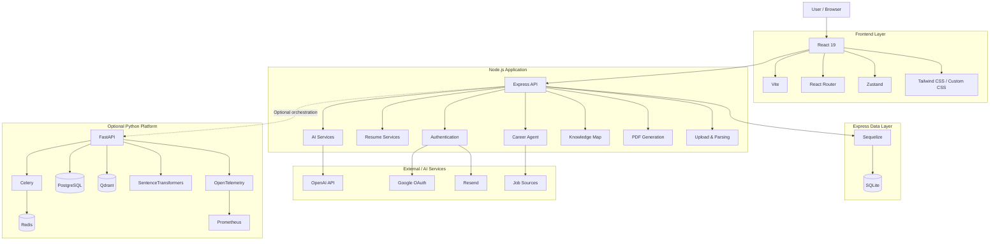

### Primary Architecture

The main production path is:

```text
Browser
   |
   v
React + Vite
   |
   v
Express API
   |
   +---- Authentication
   |
   +---- Resume Services
   |
   +---- AI Services
   |
   +---- Career Agent
   |
   +---- Knowledge Map
   |
   +---- Upload / Parsing
   |
   +---- PDF Generation
   |
   v
Sequelize
   |
   v
SQLite
```

### Optional AI Orchestration Architecture

```text
Express / Client
      |
      v
   FastAPI
      |
      +-------------------+
      |                   |
      v                   v
   Celery              RAG Layer
      |                   |
      v                   +--> SentenceTransformers
    Redis                 |
                          +--> Qdrant
      |
      v
Background Jobs

FastAPI
   |
   +--> PostgreSQL
   |
   +--> Prometheus
   |
   +--> OpenTelemetry
```

The repository documents the FastAPI platform as a separate local/containerized deployment rather than a service started by the root Vercel configuration.

---

# Application Data Flow

A typical request through the primary application follows this flow:

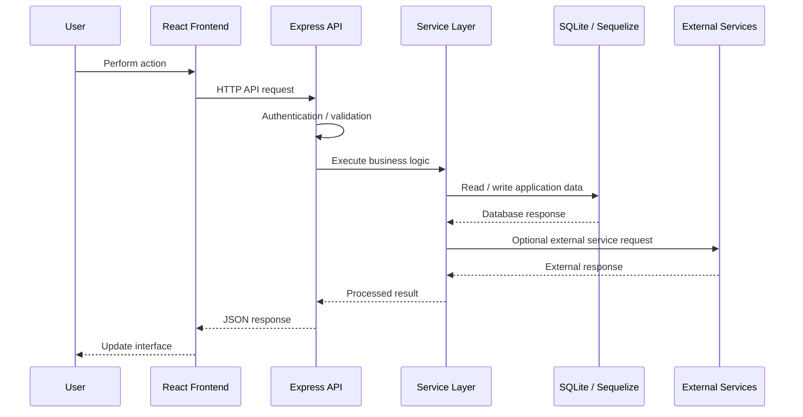

---

# AI Career Agent Architecture

The Career Agent is organized around multiple career-related workflows.

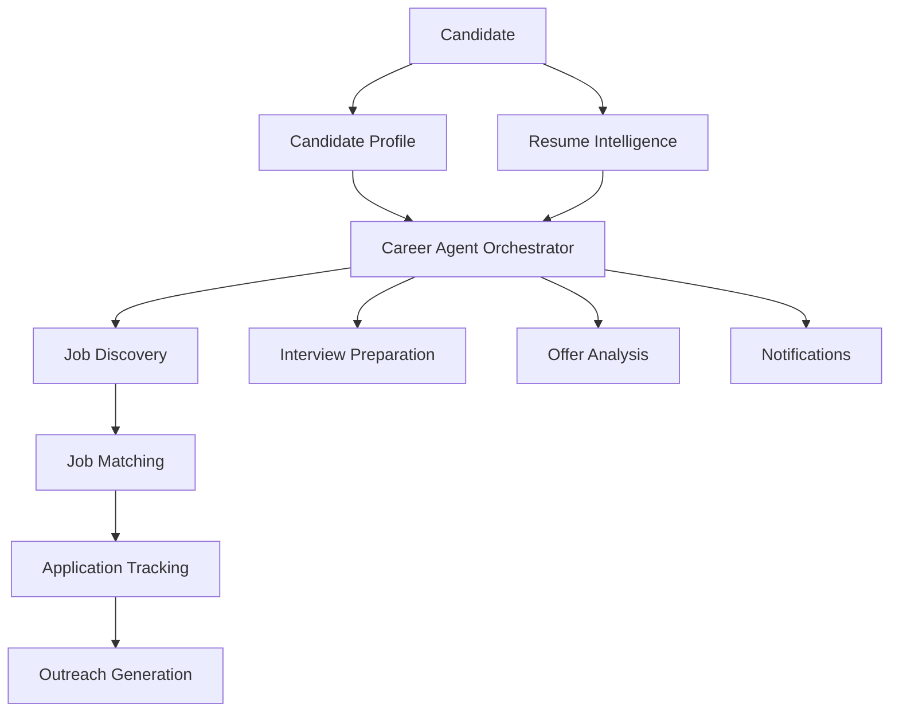

## Career Agent Workflow

```text
Candidate Profile
       |
       v
Resume Intelligence
       |
       v
Career Agent
       |
       +----> Job Discovery
       |
       +----> Job Matching
       |
       +----> Applications
       |
       +----> Outreach
       |
       +----> Interview Preparation
       |
       +----> Offer Analysis
       |
       +----> Notifications
```

---

# Knowledge Map Architecture

The Knowledge Map connects skills with career goals and learning activities.

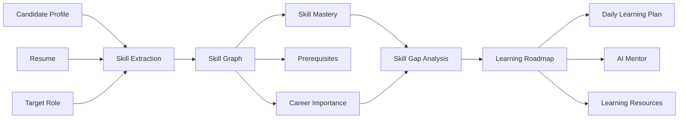

---

# Technology Stack

| Layer             | Technology           | Purpose                                    |
| ----------------- | -------------------- | ------------------------------------------ |
| Frontend          | React 19             | User interface                             |
| Build Tool        | Vite 8               | Frontend development and production builds |
| Routing           | React Router 7       | Application routing                        |
| Styling           | Tailwind CSS         | Utility-based styling                      |
| Styling           | Custom CSS           | Application-specific styling               |
| State Management  | Zustand              | Client-side application state              |
| Forms             | React Hook Form      | Form management                            |
| Icons             | Lucide React         | UI icons                                   |
| Backend           | Node.js              | Server runtime                             |
| API               | Express 4            | REST API                                   |
| Module System     | ESM                  | JavaScript modules                         |
| ORM               | Sequelize            | Database abstraction                       |
| Database          | SQLite               | Primary Express persistence                |
| Authentication    | JWT                  | Session/authentication tokens              |
| Password Security | bcryptjs             | Password hashing                           |
| OAuth             | Google OAuth         | Google authentication                      |
| File Upload       | Multer               | Resume/file uploads                        |
| PDF Parsing       | pdf-parse            | Resume extraction                          |
| PDF Generation    | Puppeteer            | Resume PDF generation                      |
| AI                | OpenAI SDK           | AI-powered functionality                   |
| Email             | Resend               | Email/OTP integration                      |
| Python API        | FastAPI              | Optional orchestration platform            |
| Python Server     | Uvicorn              | FastAPI runtime                            |
| Python Validation | Pydantic             | Request/data validation                    |
| Python ORM        | SQLAlchemy           | Python database access                     |
| Background Jobs   | Celery               | Asynchronous job processing                |
| Message Broker    | Redis                | Queue/cache/pub-sub                        |
| Relational DB     | PostgreSQL           | FastAPI durable persistence                |
| Vector DB         | Qdrant               | Vector search                              |
| Embeddings        | SentenceTransformers | Semantic embeddings                        |
| Metrics           | Prometheus           | Metrics collection                         |
| Observability     | OpenTelemetry        | Telemetry                                  |
| Deployment        | Vercel               | Main web deployment                        |
| Version Control   | Git / GitHub         | Source control                             |

---

# Repository Structure

```text
NextFolio/
│
├── api/
│   └── index.mjs
│       └── Vercel serverless API entry point
│
├── client/
│   ├── public/
│   │   └── Static assets and portfolio resources
│   │
│   ├── src/
│   │   ├── components/
│   │   │   └── Shared UI components and modals
│   │   │
│   │   ├── features/
│   │   │   └── Feature-specific frontend modules
│   │   │
│   │   ├── layouts/
│   │   │   └── Main, Career Agent and Knowledge Map layouts
│   │   │
│   │   ├── lib/
│   │   │   └── API and Google OAuth helpers
│   │   │
│   │   ├── pages/
│   │   │   └── Routed application pages
│   │   │
│   │   └── store/
│   │       └── Zustand state stores
│   │
│   ├── package.json
│   ├── QUICK_START.md
│   └── vite.config.js
│
├── server/
│   ├── agents/
│   │   └── JavaScript agent orchestration
│   │
│   ├── models/
│   │   └── Sequelize models and relationships
│   │
│   ├── routes/
│   │   └── Express API routes
│   │
│   ├── services/
│   │   └── Backend services and integrations
│   │
│   ├── fastapi_server/
│   │   ├── tests/
│   │   ├── Dockerfile
│   │   ├── docker-compose.yml
│   │   └── Python orchestration platform
│   │
│   ├── database.sqlite
│   ├── server.js
│   └── package.json
│
├── ARCHITECTURE.md
├── DEPLOYMENT_GUIDE.md
├── DOCUMENTATION_INDEX.md
├── AI_CAREER_AGENT_PLAN.md
├── PHASE_1_COMPLETION_SUMMARY.md
├── PHASE_2_IMPLEMENTATION.md
├── PHASE_2_COMPLETION.md
├── PHASE_2_QUICK_START.md
├── STATUS_DASHBOARD.md
├── package.json
├── package-lock.json
├── requirement.txt
├── requirements.txt
├── vercel.json
└── README.md
```

---

# Application Routes

## Frontend Routes

| Route              | Access        | Purpose                               |
| ------------------ | ------------- | ------------------------------------- |
| `/`                | Public        | Resume and portfolio builder          |
| `/login`           | Public        | Login and signup                      |
| `/about`           | Public        | About page                            |
| `/contact`         | Public        | Contact page                          |
| `/portfolio/:slug` | Public        | Published portfolio                   |
| `/career-agent`    | Authenticated | AI Career Agent                       |
| `/knowledge-map`   | Authenticated | Skills, roadmaps and mentor workspace |

---

# API Architecture

Express API requests use the `/api` prefix.

## API Route Groups

| Route                              | Purpose                                                   |
| ---------------------------------- | --------------------------------------------------------- |
| `/api/auth`                        | Signup, login, OTP and Google authentication              |
| `/api/resume`                      | Resume profile and resume-related data                    |
| `/api/ai`                          | Resume parsing, ATS scoring and optimization              |
| `/api/upload`                      | Resume upload and processing                              |
| `/api/generate`                    | ATS-friendly PDF generation                               |
| `/api/career-agents/orchestrator`  | Agent orchestration                                       |
| `/api/career-agents/resume`        | Candidate and resume intelligence                         |
| `/api/career-agents/jobs`          | Job discovery                                             |
| `/api/career-agents/matches`       | Job matching                                              |
| `/api/career-agents/applications`  | Applications and outreach                                 |
| `/api/career-agents/settings`      | Agent preferences                                         |
| `/api/career-agents/interviews`    | Interview workflows                                       |
| `/api/career-agents/offers`        | Offer analysis                                            |
| `/api/career-agents/notifications` | Agent notifications                                       |
| `/api/career-agents/email-sync`    | Email connection/sync simulation                          |
| `/api/knowledge-map`               | Skills, roadmaps, learning plans and mentor functionality |

---

# Authentication

NextFolio supports multiple authentication mechanisms.

## JWT Authentication

Authenticated requests use the standard Bearer token format:

```http
Authorization: Bearer <jwt>
```

The JWT secret is configured using an environment variable and should never be committed to source control.

## Password Authentication

The application uses `bcryptjs` for password hashing.

## Google OAuth

Google authentication uses:

```text
@react-oauth/google
```

The frontend receives the Google access token and sends it to:

```text
POST /api/auth/google
```

Required environment variables include:

```env
VITE_GOOGLE_CLIENT_ID=your_google_client_id
VITE_ENABLE_GOOGLE_LOGIN=true
```

For local development, configure the appropriate localhost origins in Google Cloud Console.

---

# Database Architecture

## Express Application

The primary Express application uses:

```text
SQLite
   |
   v
Sequelize ORM
```

The local database is stored at:

```text
server/database.sqlite
```

## FastAPI Platform

The optional Python platform uses PostgreSQL when available.

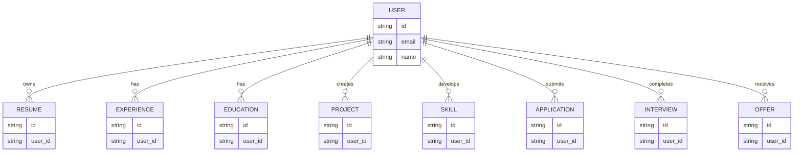

> The diagram represents the logical relationship between the platform's major career entities. The concrete Sequelize/Python models remain the authoritative database schema.

---

# Resume Processing Flow

Resume uploads are processed through a dedicated backend workflow.

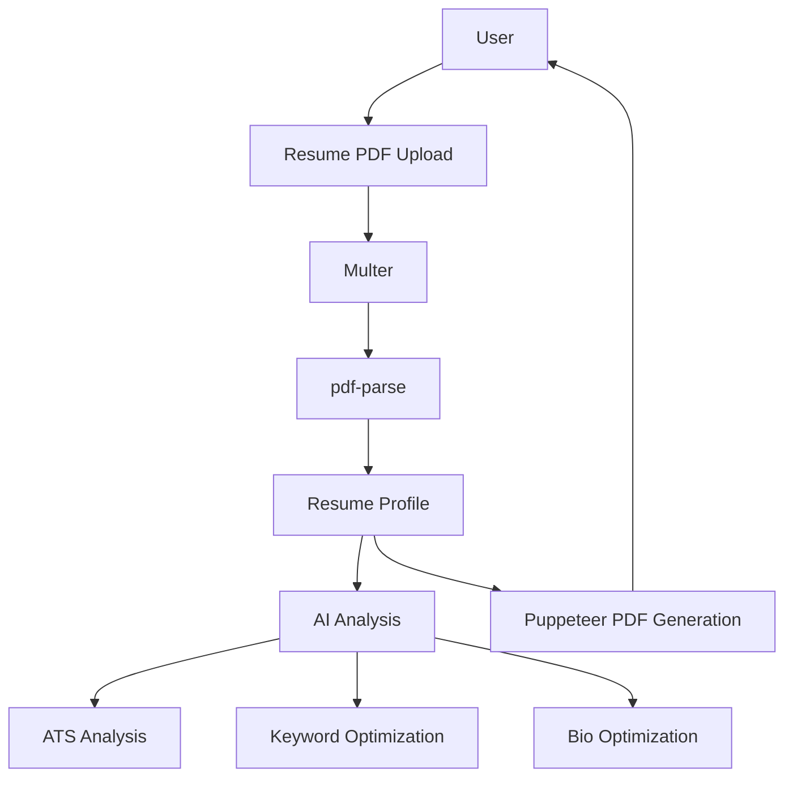

---

# Job Discovery & Matching

The Career Agent supports job discovery and candidate-job matching.

The documented job discovery integrations include:

- Remotive
- Arbeitnow

The conceptual flow is:

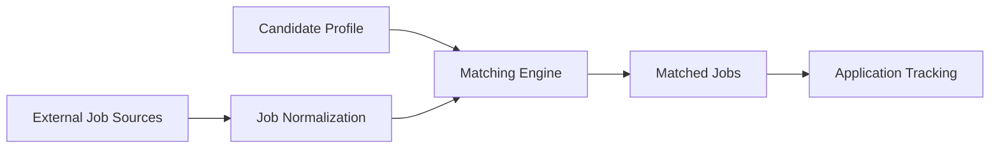

---

# Interview Preparation Flow

NextFolio provides several interview-related workflows.

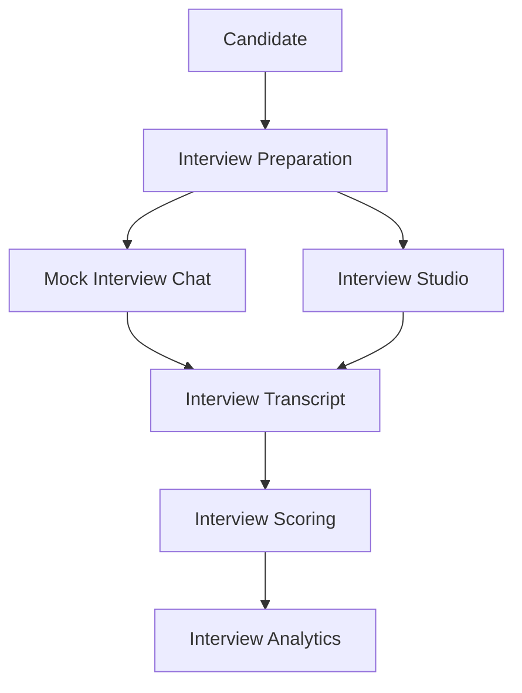

---

# RAG Architecture

The optional FastAPI platform includes a Retrieval-Augmented Generation architecture.

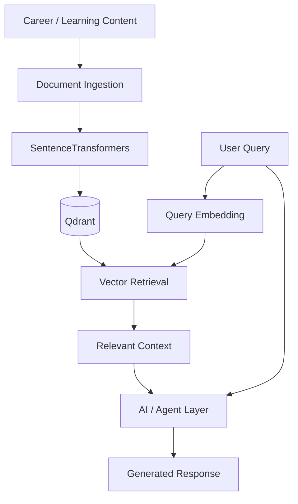

The documented FastAPI RAG endpoints include:

```text
POST /api/rag/query
POST /api/rag/ingest
```

---

# Optional FastAPI Platform

The Python platform extends NextFolio with:

- FastAPI APIs.
- Agent orchestration.
- Celery background processing.
- Redis messaging/cache.
- PostgreSQL persistence.
- Qdrant vector search.
- SentenceTransformers embeddings.
- WebSocket progress streaming.
- Prometheus metrics.
- OpenTelemetry instrumentation.

## FastAPI Services

| Service       | Default Address  | Purpose                          |
| ------------- | ---------------- | -------------------------------- |
| FastAPI       | `localhost:8000` | Python API                       |
| PostgreSQL    | `localhost:5432` | Relational database              |
| Redis         | `localhost:6379` | Cache, pub/sub and Celery broker |
| Qdrant        | `localhost:6333` | Vector database                  |
| Celery Worker | Internal         | Background jobs                  |

---

# Installation

## Prerequisites

For the primary Express application:

- Node.js 18+
- npm
- Git
- Internet connection for external integrations

For the optional FastAPI platform:

- Python 3.12+
- Docker Desktop
- Docker Compose

---

# Clone the Repository

```bash
git clone https://github.com/Aman35256/NextFolio.git
cd NextFolio
```

---

# Install Dependencies

## Server

```bash
cd server
npm install
```

## Client

```bash
cd ../client
npm install
```

---

# Environment Variables

## Server Environment

Create:

```text
server/.env
```

Example:

```env
PORT=5000

JWT_SECRET=replace_with_a_long_random_secret

OPENAI_API_KEY=optional_openai_key

RESEND_API_KEY=optional_resend_key

OTP_FROM_EMAIL=onboarding@resend.dev
```

## Client Environment

Create:

```text
client/.env
```

Example:

```env
VITE_API_URL=http://localhost:5000

VITE_GOOGLE_CLIENT_ID=your_google_oauth_client_id

VITE_ENABLE_GOOGLE_LOGIN=false

VITE_APP_VERSION=local
```

### Important

Never commit:

```text
.env
.env.local
API keys
JWT secrets
OAuth secrets
Database credentials
Production credentials
```

Use Vercel Environment Variables or another secure secret-management mechanism for production deployments.

---

# Running the Application

## Start the Express API

Open a terminal:

```bash
cd server
npm run dev
```

The API normally runs on:

```text
http://localhost:5000
```

## Start the Frontend

Open another terminal:

```bash
cd client
npm run dev
```

Vite normally provides:

```text
http://localhost:5173
```

---

# Client Scripts

From the `client` directory:

```bash
npm run dev
```

Start the Vite development server.

```bash
npm run build
```

Create the production frontend build.

```bash
npm run preview
```

Preview the production build locally.

```bash
npm run lint
```

Run ESLint.

---

# Server Scripts

From the `server` directory:

```bash
npm start
```

Start the Express API.

```bash
npm run dev
```

Start the API in development mode.

Additional development/test utilities include:

```bash
node test_prep.js
```

and:

```bash
node test_route_logic.js
```

---

# Running the FastAPI Platform

Navigate to:

```bash
cd server/fastapi_server
```

## Recommended Docker Setup

```bash
docker compose up --build
```

This starts the FastAPI platform and its supporting services.

## Run Without Docker

Install Python dependencies:

```bash
python -m pip install -r requirements.txt
```

Start FastAPI:

```bash
uvicorn app.main:app --reload --host 0.0.0.0 --port 8000
```

FastAPI will then be available at:

```text
http://localhost:8000
```

---

# FastAPI Endpoints

The documented orchestration endpoints include:

| Method    | Endpoint                                      | Purpose                       |
| --------- | --------------------------------------------- | ----------------------------- |
| GET       | `/api/health`                                 | Health check                  |
| POST      | `/api/orchestrator/run`                       | Start orchestration           |
| GET       | `/api/orchestrator/status/{orchestration_id}` | Check orchestration status    |
| WebSocket | `/api/orchestrator/stream/{orchestration_id}` | Stream orchestration progress |
| POST      | `/api/agents/{agent_action}`                  | Execute agent action          |
| POST      | `/api/rag/query`                              | Perform RAG query             |
| POST      | `/api/rag/ingest`                             | Ingest RAG content            |
| GET       | `/metrics`                                    | Prometheus metrics            |

---

# Testing

## Client

Run:

```bash
cd client
npm run lint
```

## Server

The repository includes Node-based test utilities:

```bash
cd server

node test_prep.js
node test_route_logic.js
```

## FastAPI

FastAPI tests are located under:

```text
server/fastapi_server/tests
```

Run:

```bash
cd server/fastapi_server
pytest
```

---

# Benchmarking

The FastAPI platform contains a benchmark utility.

From:

```text
server/fastapi_server
```

Run:

```bash
python benchmark.py
```

The default benchmark configuration uses 50 concurrent users.

A custom concurrency value can be supplied:

```bash
python benchmark.py 10
```

---

# Deployment

## Vercel Architecture

The primary deployment uses Vercel.

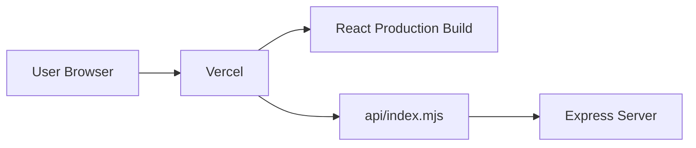

The root `vercel.json` is responsible for:

- Installing required dependencies.
- Building the React client.
- Serving `client/dist`.
- Routing `/api/*` requests to `api/index.mjs`.
- Rewriting frontend routes to `index.html`.

## Production Flow

```text
User
  |
  v
Vercel
  |
  +----> React Static Build
  |
  +----> /api/*
           |
           v
       api/index.mjs
           |
           v
        Express
```

---

# Vercel Environment Variables

Configure production secrets through the Vercel dashboard.

Relevant variables include:

```env
JWT_SECRET
VITE_API_URL
VITE_GOOGLE_CLIENT_ID
VITE_ENABLE_GOOGLE_LOGIN
OPENAI_API_KEY
RESEND_API_KEY
OTP_FROM_EMAIL
```

Only configure variables that are required by the deployed functionality.

---

# FastAPI Deployment

The FastAPI service is deployed separately from the root Vercel deployment.

Container deployment can use:

```text
server/fastapi_server/Dockerfile
```

or:

```text
server/fastapi_server/docker-compose.yml
```

The FastAPI environment requires its own configuration for:

- PostgreSQL
- Redis
- Qdrant
- Celery
- AI services
- Application configuration

---

# Security

NextFolio implements several application-level security mechanisms.

## Authentication

- JWT-based authentication.
- Password hashing with bcryptjs.
- Google OAuth integration.
- Protected API routes.

## Secret Management

Secrets are expected to be provided through environment variables.

Do not commit:

```text
JWT_SECRET
OPENAI_API_KEY
RESEND_API_KEY
Database credentials
OAuth secrets
```

## File Processing

Resume uploads are handled through Multer and processed by backend resume-processing services.

## OAuth

Google OAuth requires explicitly configured origins.

For production, configure the deployed application origin rather than arbitrary callback URLs.

---

# Error Handling

The application contains error-handling paths across its frontend and backend workflows.

Examples include:

- Authentication errors.
- Invalid requests.
- Resume processing failures.
- Upload failures.
- External service failures.
- AI service fallback behavior.
- Database-related failures.
- Background job failures.

When an OpenAI API key is not available, documented AI functionality can use deterministic local fallback behavior for supported workflows.

The FastAPI platform also provides fallback behavior for local development in some persistence and infrastructure components.

---

# Data Storage

The primary Express application stores local development data in:

```text
server/database.sqlite
```

The FastAPI platform can use:

```text
PostgreSQL
```

and has a SQLite fallback for local scenarios where PostgreSQL is unavailable.

The FastAPI environment also uses:

```text
Redis
```

for caching, pub/sub and Celery task brokering.

Qdrant is used for vector storage in RAG workflows.

---

# Known Limitations

The current architecture has several characteristics that should be considered when deploying the project at larger scale.

### 1. SQLite Primary Persistence

The Express application uses SQLite for its primary persistence path.

For high-concurrency production workloads, a production-grade relational database may be more appropriate.

### 2. Separate FastAPI Platform

The FastAPI orchestration system is separate from the root Vercel deployment.

It therefore requires independent infrastructure.

### 3. External API Dependencies

Some features depend on external services such as:

- OpenAI
- Google OAuth
- Resend
- Job discovery services

Availability and behavior can therefore depend on those services.

### 4. AI Fallback Behavior

Some AI workflows provide deterministic local fallback behavior when external AI services are unavailable.

These fallbacks should not be interpreted as equivalent to a production AI model.

### 5. Local Development Infrastructure

The full orchestration and RAG stack requires additional infrastructure such as:

- PostgreSQL
- Redis
- Qdrant
- Celery

Docker Compose is recommended for local setup.

---

# Future Improvements

Potential future improvements include:

- Production PostgreSQL migration for the primary Express path.
- Centralized database architecture between Node and Python services.
- More extensive automated test coverage.
- End-to-end browser testing.
- More advanced job-source integrations.
- Production-grade background job infrastructure.
- Enhanced observability dashboards.
- More sophisticated resume ranking models.
- Advanced candidate-job matching.
- Expanded RAG knowledge sources.
- Improved AI agent evaluation.
- Production email synchronization.
- More extensive security hardening.
- Automated CI/CD validation.

These are potential improvements rather than claims of currently implemented functionality.

---

# Development Workflow

Recommended Git workflow:

```bash
git checkout -b feature/your-feature
```

Make your changes and test them:

```bash
git add .
git commit -m "feat: describe your change"
```

Push the branch:

```bash
git push origin feature/your-feature
```

Then open a Pull Request.

---

# Contributing

Contributions are welcome.

## Contribution Process

1. Fork the repository.
2. Clone your fork.
3. Create a feature branch.
4. Make your changes.
5. Run the available linting/tests.
6. Verify the application locally.
7. Commit your changes.
8. Push your branch.
9. Open a Pull Request.

## Before Opening a Pull Request

Please verify:

- Frontend builds successfully.
- ESLint passes.
- Backend starts successfully.
- New API functionality is tested.
- Environment variables are documented.
- No secrets are committed.
- Documentation reflects the implementation.
- Existing functionality is not unnecessarily broken.

---

# Contributors

Contributions, ideas, bug reports, documentation improvements, and feature suggestions are welcome.

To contribute:

1. Fork the repository.
2. Create a feature branch.
3. Implement your changes.
4. Test the changes locally.
5. Submit a Pull Request.

### Contributors

Contributors to the project can be viewed through the repository's GitHub contributor history:

**GitHub Contributors:**
https://github.com/Aman35256/NextFolio/graphs/contributors

If you contribute to NextFolio, your GitHub profile may appear in the repository's contributor graph based on your contributions.

---

# Project Documentation

The repository contains additional technical documentation:

- `ARCHITECTURE.md`
- `DEPLOYMENT_GUIDE.md`
- `DOCUMENTATION_INDEX.md`
- `AI_CAREER_AGENT_PLAN.md`
- `PHASE_1_COMPLETION_SUMMARY.md`
- `PHASE_2_IMPLEMENTATION.md`
- `PHASE_2_COMPLETION.md`
- `PHASE_2_QUICK_START.md`
- `STATUS_DASHBOARD.md`

These documents provide additional implementation and development context.

---

# License

This repository does not currently specify a license.

If you intend to make the project open source, add an appropriate license file such as:

```text
LICENSE
```

and update this section accordingly.

---

# Project Metadata

| Property              | Details                       |
| --------------------- | ----------------------------- |
| Project               | NextFolio                     |
| Type                  | Full-stack AI Career Platform |
| Frontend              | React 19 + Vite               |
| Backend               | Node.js + Express             |
| State Management      | Zustand                       |
| Primary Database      | SQLite                        |
| ORM                   | Sequelize                     |
| Authentication        | JWT + Google OAuth            |
| AI                    | OpenAI SDK + local fallbacks  |
| Resume Processing     | Multer + pdf-parse            |
| PDF Generation        | Puppeteer                     |
| Python Platform       | FastAPI                       |
| Background Processing | Celery + Redis                |
| Vector Database       | Qdrant                        |
| Embeddings            | SentenceTransformers          |
| Relational Database   | PostgreSQL                    |
| Observability         | Prometheus + OpenTelemetry    |
| Deployment            | Vercel                        |
| Repository            | GitHub                        |
| Status                | Active Development            |

---

# Architecture Summary

At a high level, NextFolio can be represented as:

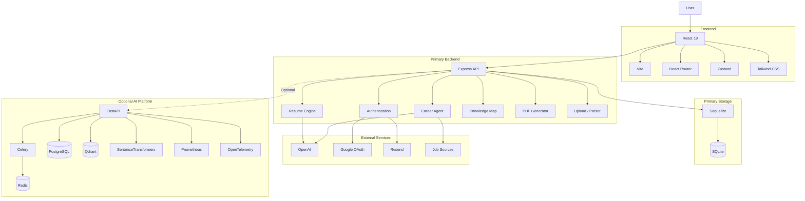

---

# Final Summary

NextFolio brings together the major stages of the modern career workflow:

```text
                    NEXTFOLIO
                        |
        +---------------+---------------+
        |               |               |
        v               v               v
     RESUME          CAREER          KNOWLEDGE
     BUILDER         AGENT             MAP
        |               |               |
        v               v               v
     Portfolio       Job Search       Skills
     ATS Analysis    Matching         Roadmaps
     PDF Resume      Applications     Skill Gaps
                     Interviews       Daily Plans
                     Offers           AI Mentor
        |               |               |
        +---------------+---------------+
                        |
                        v
                Unified Career Profile
```

The platform therefore acts as a unified environment for **professional profile creation, career discovery, job management, interview preparation, and continuous skill development**.
